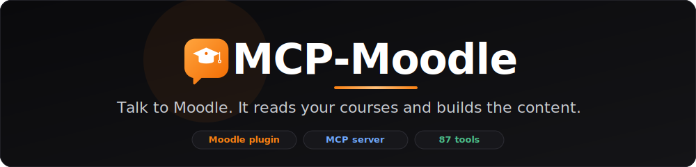

<div align="center">



<br><br>

[](https://nmaaalhawary.github.io/MCP-Moodle/)
[](https://github.com/NmaaAlhawary/MCP-Moodle/actions/workflows/ci.yml)
[](LICENSE)
[](https://www.python.org/)
[](https://moodle.org/)
[](https://modelcontextprotocol.io/)
[](https://github.com/NmaaAlhawary/MCP-Moodle/releases)
[](CONTRIBUTING.md)

<samp>🌐 **[Live site & guide](https://nmaaalhawary.github.io/MCP-Moodle/)** · [**Quick start**](#quick-start) · [**Tools**](#tool-reference) · [**How it works**](#how-it-works-two-pieces) · [**Contributing**](#contributing) · [**Releases**](https://github.com/NmaaAlhawary/MCP-Moodle/releases)</samp>

<br>

> _"Create a course called Biology 101, add a welcome page, and enrol these five students."_
> <br>→ and it actually happens.

</div>

---

## Table of contents

- [What it does](#what-it-does)
- [How it works (two pieces)](#how-it-works-two-pieces)
- [Features](#features)
- [Quick start](#quick-start)
  - [1. Install the plugin](#1-install-the-plugin-local_mcpbridge)
  - [2. Enable web services & get a token](#2-enable-web-services--generate-a-token)
  - [3. Run the MCP server](#3-run-the-mcp-server)
  - [4. Connect Claude Desktop](#4-connect-claude-desktop)
- [Tool reference](#tool-reference)
- [Testing from the shell](#testing-from-the-shell)
- [Safety & write mode](#safety--write-mode)
- [Extending it](#extending-it)
- [Contributing](#contributing)
- [License](#license)

---

## What it does

Moodle is the learning platform used by thousands of universities and schools.
**MCP-Moodle** connects it to any [Model Context Protocol](https://modelcontextprotocol.io/)
client (like Claude Desktop), so an AI can:

- **Read** — list courses, inspect course contents, see enrolled students, quizzes, and grades.
- **Build** — create courses, users, categories, groups, enrolments, and *actual content*:
  pages, books, labels, URLs, quizzes, and quiz questions.
- **Safely** — every write operation is off by default and only enabled with an explicit flag.

## How it works (two pieces)

Moodle's built-in Web Services API can create courses and users — but it has **no
core function to create an activity** (a Page, Book, Quiz…). So this project ships
two parts that work together:

```
┌────────────────┐     MCP tools      ┌──────────────────┐    REST + token    ┌─────────────────┐
│  AI client     │ ◄────────────────► │   moodle-mcp     │ ◄────────────────► │   Moodle site   │
│ (Claude, etc.) │                    │  (Python server) │                    │  + local plugin │
└────────────────┘                    └──────────────────┘                    └─────────────────┘
```

| Piece | Path | Role |
|---|---|---|
| **Moodle plugin** | [`local/mcpbridge/`](local/mcpbridge) | Adds the activity-creation web service functions Moodle core is missing — using Moodle's official `add_moduleinfo()` helper, so it's upgrade-safe (no raw DB writes). |
| **MCP server** | [`moodle-mcp/`](moodle-mcp) | Wraps Moodle's read/write API — core *and* the plugin's new functions — as typed MCP tools for an AI client. |

## Features

- **40+ tools** — reads, a student-assistant layer (deadlines, dashboards, task analysis), core writes, and activity creation
- **Read/write split** — read tools always on; write tools gated behind `MOODLE_ALLOW_WRITE=true`
- **Upgrade-safe plugin** — uses Moodle's own `add_moduleinfo()`, never touches module tables directly
- **Clean error handling** — detects Moodle's JSON-error-on-HTTP-200 quirk and surfaces readable messages
- **Token never logged** — config from environment variables only
- **One token for everything** — read, core writes, and the plugin functions in a single service

---

## Quick start

### 1. Install the plugin (`local_mcpbridge`)

Copy the `local/mcpbridge/` folder into your Moodle so it lives at
`{moodle}/local/mcpbridge/`, then visit **Site administration** as an admin —
Moodle will detect it and prompt you to upgrade. Confirm, and you're done.

### 2. Enable web services & generate a token

In Moodle as an admin:

1. **Enable web services** — *Site administration → Advanced features* → tick **Enable web services**.
2. **Enable REST** — *Server → Web services → Manage protocols* → enable **REST protocol**.
3. **Build the service** — *Server → Web services → External services*. Use the
   ready-made **MCP Bridge Service** the plugin created, then click **Functions**
   and add the core read/write functions you want (list in [Tool reference](#tool-reference)).
4. **Authorise a user** for the service and make sure they have the needed
   capabilities (notably `moodle/course:manageactivities` in the target courses).
5. **Create a token** — *Server → Web services → Manage tokens* → pick the user and
   the **MCP Bridge Service**. Copy it.

> **Verify before you wire up the AI:** run the [test script](#testing-from-the-shell)
> to confirm the plugin and token work end to end.

### 3. Run the MCP server

```bash
cd moodle-mcp
python3 -m venv .venv && source .venv/bin/activate
pip install -r requirements.txt
cp .env.example .env        # then edit .env with your URL + token
python server.py
```

| Env var | Meaning |
|---|---|
| `MOODLE_URL` | Base URL, no trailing slash |
| `MOODLE_TOKEN` | The token from step 2 (never logged) |
| `MOODLE_ALLOW_WRITE` | `true` to enable write tools; anything else = read-only |

### 4. Connect Claude Desktop

Add to `claude_desktop_config.json`:

```json
{
  "mcpServers": {
    "moodle": {
      "command": "/absolute/path/to/moodle-mcp/.venv/bin/python",
      "args": ["/absolute/path/to/moodle-mcp/server.py"],
      "env": {
        "MOODLE_URL": "https://moodle.example.edu",
        "MOODLE_TOKEN": "your_token_here",
        "MOODLE_ALLOW_WRITE": "true"
      }
    }
  }
}
```

Restart Claude Desktop and the Moodle tools appear.

---

## Tool reference

### Read (always on)

| Tool | Moodle function |
|---|---|
| `verify_connection` | `core_webservice_get_site_info` |
| `list_courses` | `core_course_get_courses` |
| `search_courses` | `core_course_get_courses_by_field` |
| `get_course_content` | `core_course_get_contents` |
| `get_enrolled_users` | `core_enrol_get_enrolled_users` |
| `list_quizzes` | `mod_quiz_get_quizzes_by_courses` |
| `get_user_grades` | `gradereport_user_get_grade_items` |

### Student & analysis (always on)

Higher-level tools that combine the raw functions above into a student's-eye
view. The **analysis** tools (`analyze_assignment`, `decompose_task`,
`create_implementation_plan`, …) gather and structure the relevant Moodle data;
the calling AI does the natural-language reasoning over it.

| Tool | Description |
|---|---|
| `get_my_courses` | All courses the current user is enrolled in |
| `search_course_materials` | Search across all course materials by query |
| `get_course_announcements` | Announcements from course news forums (optional course filter) |
| `get_recent_activity` | Recent activity/updates across courses since a given time |
| `get_assignments` | Assignments for courses (optional course filter) |
| `get_assignment_status` | Submission and grading status for one assignment |
| `get_upcoming_deadlines` | Upcoming deadlines across courses, soonest first |
| `get_overdue_assignments` | Unsubmitted assignments past due, most overdue first |
| `get_actionable_tasks` | Prioritized list of tasks needing action, by urgency |
| `analyze_assignment` | Status, requirements, materials, progress, deadline for one assignment |
| `extract_assignment_requirements` | Source text + attachments for requirement analysis |
| `find_relevant_materials` | Course content relevant to an assignment, ranked |
| `decompose_task` | Assignment context + days available (scaffold for subtasks) |
| `create_implementation_plan` | Context + milestone dates (scaffold for a step-by-step plan) |
| `get_grades` | Grade overview for all courses, or detailed grades for one |
| `get_course_progress` | Progress/completion for one course or all |
| `get_course_health` | Progress, grade, unsubmitted & overdue counts for a course |
| `get_study_load` | Assignment distribution by week to spot heavy weeks |
| `get_upcoming_events` | Upcoming calendar events |
| `semester_dashboard` | Combined courses + deadlines + grades snapshot |
| `daily_briefing` | Overdue count, today's deadlines, recent grades, events, tasks |
| `weekly_review` | Submitted/graded counts, deadlines, overdue, progress |
| `ask_moodle` | Route a natural-language question to the right data source |

> These need extra web service functions in the token's service:
> `core_enrol_get_users_courses`, `mod_assign_get_assignments`,
> `mod_assign_get_submission_status`, `gradereport_overview_get_course_grades`,
> `core_calendar_get_action_events_by_timesort`, `mod_forum_get_forums_by_courses`,
> `mod_forum_get_forum_discussions`, and
> `core_completion_get_activities_completion_status`. Add the ones you need to
> **MCP Bridge Service** (a tool that needs a missing function returns a clean
> "access control exception" you can act on).

### Write (only when `MOODLE_ALLOW_WRITE=true`)

| Tool | Moodle function | Source |
|---|---|---|
| `create_course` | `core_course_create_courses` | core |
| `create_category` | `core_course_create_categories` | core |
| `create_user` | `core_user_create_users` | core |
| `enrol_user` | `enrol_manual_enrol_users` | core |
| `enrol_users` (bulk) | `enrol_manual_enrol_users` | core |
| `add_group_members` | `core_group_add_group_members` | core |
| `create_group` | `core_group_create_groups` | core |
| `upload_file` | `core_files_upload` | core |
| `create_page` | `local_mcpbridge_create_page` | **plugin** |
| `create_book` | `local_mcpbridge_create_book` | **plugin** |
| `create_label` | `local_mcpbridge_create_label` | **plugin** |
| `create_url` | `local_mcpbridge_create_url` | **plugin** |
| `create_quiz` | `local_mcpbridge_create_quiz` | **plugin** |
| `create_forum` | `local_mcpbridge_create_forum` | **plugin** |
| `create_choice` | `local_mcpbridge_create_choice` | **plugin** |
| `create_assignment` | `local_mcpbridge_create_assignment` | **plugin** |
| `create_section` | `local_mcpbridge_create_section` | **plugin** |
| `update_activity` | `local_mcpbridge_update_activity` | **plugin** |
| `delete_activity` | `local_mcpbridge_delete_activity` | **plugin** |
| `add_quiz_question` | `local_mcpbridge_add_quiz_question` | **plugin** |
| `add_truefalse_question` | `local_mcpbridge_add_truefalse_question` | **plugin** |
| `add_shortanswer_question` | `local_mcpbridge_add_shortanswer_question` | **plugin** |

> **Quizzes:** `create_quiz` makes the container; `add_quiz_question` (stretch goal)
> uses Moodle's Question Bank API to add a multiple-choice question. That API is
> version-sensitive — test it on your Moodle version first.

---

## Testing from the shell

Confirm the plugin + token work before wiring up the AI:

```bash
cd moodle-mcp

# Read-only checks (site info + course list):
MOODLE_URL=https://moodle.example.edu MOODLE_TOKEN=xxxx ./test_rest.sh

# Full write test — creates a page, label, url, book, quiz + question in COURSEID:
MOODLE_URL=https://moodle.example.edu MOODLE_TOKEN=xxxx COURSEID=2 ./test_rest.sh --write
```

A successful create returns e.g. `{"cmid": 47, "instanceid": 12}`. A Moodle error
(still HTTP 200) returns a JSON object with an `exception` field, which the server
surfaces as a clean message.

---

## Safety & write mode

For a full hardening checklist (dedicated service account, scoped role, HTTPS, token expiry), see **[SECURITY.md](SECURITY.md)**.

- **Writes hit live data.** Every write tool creates or changes real records. There is no dry-run.
- **Writes are gated.** If `MOODLE_ALLOW_WRITE` is not exactly `true`, the server registers **read tools only** — writes cannot be exposed by accident.
- **The token is the blast radius.** Bind it to a dedicated service account with only the capabilities and courses you need. A site-admin token lets the AI do anything an admin can.
- **The token is never logged** — read from the environment, sent only to Moodle over HTTPS.
- **Start read-only.** Turn on write mode deliberately, on a test course, and confirm the shell test passes first.

---

## Extending it

Adding a new capability (e.g. `create_assignment`, `create_forum`) is copy-paste-modify.
Each plugin function follows the same three-method shape — see
[`create_page.php`](local/mcpbridge/classes/external/create_page.php) as the template,
and [CONTRIBUTING.md](CONTRIBUTING.md) for the full recipe.

---

## Contributing

Contributions are very welcome — this is built to be extended!

1. **Fork** the repo (top-right **Fork** button).
2. Create a branch: `git checkout -b feature/my-thing`.
3. Make your change and test it (`php -l`, `py_compile`, ideally against a real Moodle).
4. Push and open a **Pull Request** to `main`.

See **[CONTRIBUTING.md](CONTRIBUTING.md)** for the full workflow, coding standards,
and the pattern for adding a new function. Please also read our
[Code of Conduct](CODE_OF_CONDUCT.md). Found a bug or want a feature? Open an
[issue](../../issues).

---

## License

[MIT](LICENSE) — free to use, modify, and distribute.

<div align="center">
<sub>Built for educators, admins, and anyone who wants to talk to Moodle instead of clicking through it.</sub>
</div>
